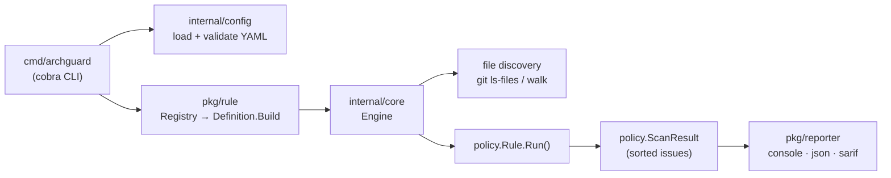

# 🛡️ ArchGuard

> **An Open-Source Engineering Policy Engine (ESLint for Engineering Policies)**
> 
> *เปลี่ยนกฎการเขียนโค้ด มาตรฐานความปลอดภัย และสถาปัตยกรรมขององค์กร ให้กลายเป็นการตรวจสอบอัตโนมัติ (Automated Engineering Policy Engine)*

[](https://github.com/jakkayy/archGuard/actions/workflows/ci.yml)
[](https://github.com/jakkayy/archGuard/releases)
[](https://golang.org)
[](LICENSE)
[](CONTRIBUTING.md)

---

## 📌 Vision & Problem Statement

เมื่อทีมพัฒนามีขนาดใหญ่ขึ้น ปัญหาเรื่องมาตรฐานโค้ดและการละเมิดสถาปัตยกรรมมักจะเกิดขึ้นซ้ำๆ เช่น:
- 🔐 **Hardcoded Secrets:** มีคนเผลอวาง API Keys, AWS Credentials, หรือ Private Keys ลงในโค้ดดิบ
- 📁 **Structure & Mandatory Files:** ลืมสร้างไฟล์เอกสารสำคัญประจำองค์กร เช่น `README.md`, `.gitignore`, `Dockerfile`
- 📄 **Missing API Contract:** Backend ไม่มีไฟล์ OpenAPI Spec ทำให้ทีม Frontend/Mobile ไม่มีสัญญา API ให้อ้างอิง
- 📐 **Code Naming Standards:** ลืมทำตาม Naming Convention ของแต่ละ Framework

**ArchGuard** ทำหน้าที่เป็น **Engineering Policy Engine** ที่สแกนและบังคับใช้กฎทางวิศวกรรมแบบสากล ตั้งแต่บนเครื่องของ Developer ไปจนถึงระบบ CI/CD บน GitHub

---

## 🌟 Key Features

- 🚀 **CLI-First & Shift-Left:** Single binary เขียนด้วย Go สแกนบนเครื่อง Developer ได้ทันที (repo ขนาดเล็ก–กลางใช้เวลาระดับมิลลิวินาที) และเคารพ `.gitignore` อัตโนมัติ
- 🪄 **Interactive Setup Wizard (`archguard init`):** คำถามภาษาอังกฤษ 100% ปรับแต่ง `archguard.yaml` ให้ตรงตามสเปกโปรเจกต์อัตโนมัติ (รองรับ **Frontend**, **Backend**, **Full-Stack App**, และ **Library**)
- 🛡️ **Rich Built-in Policy Rules:**
  - `file-naming`: ตรวจมาตรฐานการตั้งชื่อไฟล์และโฟลเดอร์ตาม Regex (รองรับวงเล็บ `[id]` ของ Next.js)
  - `no-secrets`: สแกนหา AWS Access Keys, Private Keys, GitHub Tokens, Bearer Tokens และ Hardcoded Secrets พร้อมระบุ **เลขบรรทัด** และปิด false positive รายบรรทัดได้ด้วย comment `archguard:ignore`
  - `required-files`: ตรวจบังคับความมีอยู่ของไฟล์สำคัญประจำองค์กร (เช่น `README.md`, `.gitignore`)
  - `openapi-exists`: ตรวจสอบความมีอยู่ของไฟล์เอกสารสัญญา API (OpenAPI/Swagger Spec)
- 📜 **Built-in Policy Catalog (`archguard rules`):** เรียกดูรายชื่อกฎ พารามิเตอร์ และ Default Severity บน Terminal ได้ทันที
- ⚓ **Git Pre-commit Hook Integration (`archguard install-hook`):** ติดตั้งระบบตรวจความถูกต้องอัตโนมัติก่อนสั่ง `git commit` (ไม่เขียนทับ hook เดิมของคุณ)
- 🤖 **Reusable GitHub Action (`uses: jakkayy/archGuard@v1`):** ติดตั้ง สแกน และอัปโหลด SARIF ในขั้นตอนเดียว
- ✅ **Strict Config Validation:** severity ผิด, ชื่อ rule สะกดผิด (พร้อม *did you mean*), parameter ที่ไม่รู้จักหรือผิด type จะถูกแจ้งทันที ไม่ผ่านแบบเงียบๆ
- 📊 **Multi-Format Reporting:** รองรับ Colored Console, JSON (`--format=json`), และ **SARIF v2.1.0 (`--format=sarif`)** สำหรับแสดงผลบน **GitHub Security Alerts** และไฮไลต์บรรทัดโค้ดใน **Pull Request**
- 📦 **Automated Cross-Platform Releases:** ใช้ GoReleaser สร้าง Binary สำหรับ **Linux, macOS (Apple Silicon & Intel), และ Windows** พร้อม `checksums.txt` และ changelog อัตโนมัติ

---

## ⚡ Quick Start

### 1. Installation

#### Option A: Install via Go (Recommended for Developers)
```bash
go install github.com/jakkayy/archGuard/cmd/archguard@latest
```

#### Option B: Download Pre-compiled Binary
ดาวน์โหลดไฟล์สำเร็จรูปสำหรับ OS ของคุณจากหน้า [GitHub Releases](https://github.com/jakkayy/archGuard/releases/latest) แล้วนำไปวางไว้ใน System PATH

---

### 2. Initialize Project Configuration

เปิด Terminal ในโฟลเดอร์โปรเจกต์ของคุณแล้วรันคำสั่ง Interactive Wizard:
```bash
archguard init
```

---

### 3. Install Git Pre-Commit Hook (Optional but Recommended)

สั่งติดตั้งระบบตรวจสอบอัตโนมัติก่อนทำ `git commit` เพียงครั้งเดียว:
```bash
archguard install-hook
```

---

### 4. Run Policy Scan

```bash
archguard scan
```

ตัวอย่างผลลัพธ์:

```text
🛡️  ArchGuard Policy Scan Report
──────────────────────────────────────────────────
[🚨 ERROR] required file '.gitignore' was not found in the workspace (.gitignore)
       Rule: required-files
       Suggestion: Create mandatory file '.gitignore'

[🚨 ERROR] Potential AWS Access Key ID detected (config.go:3)
       Rule: no-secrets
       Suggestion: Remove hardcoded secret and use environment variables or a secret manager (or add 'archguard:ignore' if this is a false positive)

──────────────────────────────────────────────────
Scan Time: 1 ms | Errors: 2 | Warnings: 0
Result: FAILED ❌ (Fix ERROR level issues before merging)
```

---

## 💻 CLI Command Reference

| Command | Description | Flags |
| :--- | :--- | :--- |
| `archguard init` | เปิดหน้าต่าง Interactive Setup Wizard เพื่อสร้างไฟล์ `archguard.yaml` | `-f, --force` (เขียนทับไฟล์เดิม)<br>`-y, --non-interactive` (ข้ามคำถาม) |
| `archguard scan` | สแกนโปรเจกต์เพื่อตรวจสอบข้อผิดพลาดตามกฎใน `archguard.yaml` | `-c, --config <file>` (ไฟล์คอนฟิก)<br>`-f, --format <console\|json\|sarif>`<br>`--no-color` |
| `archguard rules` | แสดงรายการ Built-in Policy Rules ทั้งหมดพร้อมคำอธิบายและพารามิเตอร์ | N/A |
| `archguard --version` | แสดงเวอร์ชันที่ติดตั้ง | N/A |
| `archguard install-hook` | ติดตั้ง Pre-commit Hook (หาตำแหน่งผ่าน `git rev-parse` จึงรองรับ subdirectory, worktree และ `core.hooksPath`) จะไม่เขียนทับ hook เดิมที่ไม่ได้สร้างโดย ArchGuard | `--force` (เขียนทับ hook เดิม) |
| `archguard uninstall-hook` | ลบ Pre-commit Hook ที่ ArchGuard ติดตั้งไว้ | N/A |

**Exit codes ของ `archguard scan`:**

| Code | ความหมาย |
| :--- | :--- |
| `0` | ผ่าน (ไม่มี ERROR-level violation) |
| `1` | พบ ERROR-level policy violation |
| `2` | ใช้งานผิด / config ไม่ถูกต้อง / เกิดข้อผิดพลาดระหว่างรัน |

---

## ⚙️ Configuration Reference (`archguard.yaml`)

```yaml
version: "v1"

# ----------------------------------------------------
# 📂 Ignore Paths (ข้ามไฟล์/โฟลเดอร์ที่ไม่ต้องการตรวจ)
#   - ไม่มี "/"  → match ชื่อโฟลเดอร์/ไฟล์ที่ระดับไหนก็ได้ (รองรับ glob)
#   - มี "/"    → อ้างอิงจาก root ของโปรเจกต์
# ----------------------------------------------------
ignore:
  - "tmp"              # tmp/ ทุกระดับ
  - "*.gen.go"         # ไฟล์ generated
  - "docs/generated"   # เฉพาะ docs/generated ที่ root

# ----------------------------------------------------
# 🛡️ Engineering Policies Rules
# ----------------------------------------------------
rules:
  # 1. File Naming Policy
  file-naming:
    enabled: true
    severity: WARNING
    pattern: '^[a-zA-Z0-9._\-\[\]\(\)]+$'

  # 2. Mandatory Files Check
  required-files:
    enabled: true
    severity: ERROR
    files:
      - "README.md"
      - ".gitignore"

  # 3. No Hardcoded Secrets Check
  no-secrets:
    enabled: true
    severity: ERROR

  # 4. OpenAPI Specification Check
  openapi-exists:
    enabled: false
    severity: ERROR
    path: "docs/openapi.json"
```

> **File discovery:** ถ้ารันใน Git repository ArchGuard จะใช้ `git ls-files` จึงเคารพ `.gitignore` อัตโนมัติ
> และข้ามโฟลเดอร์ cache/tooling (`node_modules`, `.next`, `__pycache__`, ...) ทุกระดับ
> ส่วนโฟลเดอร์ build output (`bin`, `dist`, `build`, `vendor`, `target`, ...) จะถูกข้ามเฉพาะที่ root เท่านั้น
>
> **Severity:** รับ `ERROR`, `WARNING` (หรือ `WARN`), `INFO` แบบไม่สนตัวพิมพ์เล็ก/ใหญ่ ค่าอื่นจะ error ทันที
> และชื่อ rule ที่สะกดผิดจะถูกแจ้งพร้อมคำแนะนำ (did you mean ...?)

---

## 🤖 CI/CD Integration (GitHub Actions)

สร้างไฟล์ `.github/workflows/policy-check.yml` ในโปรเจกต์งานของคุณ:

```yaml
name: ArchGuard Engineering Policy Check

on: [push, pull_request]

permissions:
  contents: read
  security-events: write # สำหรับอัปโหลด SARIF ไปที่ Security tab

jobs:
  archguard:
    runs-on: ubuntu-latest
    steps:
      - uses: actions/checkout@v4
      - uses: jakkayy/archGuard@v1
        # with:
        #   version: v1.0.0          # ค่าเริ่มต้น: latest
        #   config: archguard.yaml
        #   upload-sarif: "true"     # ไฮไลต์บรรทัดที่ผิดใน Pull Request
        #   fail-on-violation: "true"
```

| Input | Default | คำอธิบาย |
| :--- | :--- | :--- |
| `version` | `latest` | Release tag ที่จะติดตั้ง หรือ `preinstalled` ถ้ามี `archguard` ใน PATH แล้ว |
| `config` | `archguard.yaml` | Path ของไฟล์ config |
| `working-directory` | `.` | โฟลเดอร์ที่จะสแกน |
| `upload-sarif` | `true` | อัปโหลดผลไปที่ GitHub Code Scanning |
| `fail-on-violation` | `true` | ให้ job fail เมื่อพบ ERROR-level violation |

Output `exit-code` (`0` ผ่าน, `1` พบ violation, `2` error)

---

## 🏗️ Architecture



```
archGuard/
├── action.yml                # Reusable GitHub Action (composite)
├── .goreleaser.yaml          # Cross-platform release config
├── .golangci.yml             # Lint config used in CI
├── cmd/archguard/            # CLI commands: init, scan, rules, install-hook, uninstall-hook
├── internal/
│   ├── config/               # archguard.yaml loader & validation
│   └── core/                 # Engine orchestration & file discovery
├── pkg/
│   ├── policy/               # Public contract: Rule, Issue, Severity, ScanContext, ScanResult
│   ├── rule/                 # Built-in rules + Registry (ID → Factory, param specs)
│   └── reporter/             # Console, JSON, SARIF v2.1.0 reporters
└── docs/                     # Product vision/spec and demo recording script
```

### Adding a rule

1. Implement `policy.Rule` (`ID`, `Name`, `Description`, `Severity`, `Run`) in `pkg/rule/`
2. Add a `rule.Definition` (ID, params, factory) in `Builtins()` — `scan`, `rules`, config validation และ SARIF rule catalog จะรู้จัก rule ใหม่อัตโนมัติ
3. เขียน unit test ทั้งกรณีผ่านและไม่ผ่าน (ดู [CONTRIBUTING.md](CONTRIBUTING.md))

---

## 🗺️ Roadmap

- [ ] `layer-boundary`: ห้าม package/layer หนึ่ง import อีก layer (เช่น `handler` → `repository`)
- [ ] `openapi-breaking-change`: เทียบ OpenAPI spec กับ base branch เพื่อตรวจ breaking changes
- [ ] โหลด custom rules จากภายนอก (plugin)
- [ ] HTML report

---

## 📄 License

This project is licensed under the [MIT License](LICENSE).
