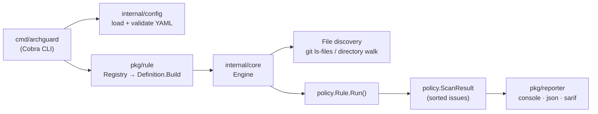

# 🛡️ ArchGuard

**An engineering policy engine for your repositories — think ESLint, but for team-wide engineering rules.**

ArchGuard turns the rules your team keeps repeating in code review ("don't commit secrets", "every service needs an OpenAPI spec", "follow our file naming convention") into automated checks that run on every developer's machine and in CI.

[](https://github.com/jakkayy/archGuard/actions/workflows/ci.yml)
[](https://github.com/jakkayy/archGuard/releases)
[](go.mod)
[](LICENSE)

---

## Why ArchGuard?

As teams grow, the same problems slip through review again and again:

- 🔐 **Hardcoded secrets** — AWS keys, private keys or API tokens committed in plain text.
- 📁 **Missing mandatory files** — no `README.md`, `.gitignore`, or other files your organization requires.
- 📄 **Missing API contracts** — backend services shipped without an OpenAPI spec for frontend and mobile teams.
- 📐 **Inconsistent naming** — files that ignore the conventions of your framework.

ArchGuard checks all of these with a single, fast binary — locally, as a pre-commit hook, and in CI with results shown inline on pull requests.

## Features

- 🚀 **Single static binary** written in Go. Scans small-to-medium repositories in milliseconds and respects `.gitignore` automatically.
- 🛡️ **Built-in rules** for secrets, file naming, required files and OpenAPI spec presence.
- 📊 **Three output formats** — colored console, JSON, and **SARIF v2.1.0** for GitHub Code Scanning, with line-level annotations on pull requests.
- 🤖 **Reusable GitHub Action** — install, scan and upload SARIF in one step: `uses: jakkayy/archGuard@v1`.
- ⚓ **Git pre-commit hook** that never overwrites a hook you already have.
- 🪄 **Interactive setup wizard** that generates a config tailored to frontend, backend, full-stack or library projects.
- ✅ **Strict config validation** — invalid severities, misspelled rule names (with *did you mean …?* hints), unknown parameters and wrong types fail loudly instead of being silently ignored.
- 🔢 **CI-friendly exit codes** that distinguish policy violations from configuration errors.

---

## Quick start

### 1. Install

**With Go** (1.25+):

```bash
go install github.com/jakkayy/archGuard/cmd/archguard@latest
```

**Or download a pre-built binary** for Linux, macOS (Intel & Apple Silicon) or Windows from [GitHub Releases](https://github.com/jakkayy/archGuard/releases/latest). Every release includes a `checksums.txt` file:

```bash
sha256sum --ignore-missing -c checksums.txt
```

### 2. Create a config

```bash
archguard init        # interactive wizard
archguard init -y     # or accept the defaults
```

### 3. Scan

```bash
archguard scan
```

```text
🛡️  ArchGuard Policy Scan Report
──────────────────────────────────────────────────
[🚨 ERROR] required file '.gitignore' was not found in the workspace (.gitignore)
       Rule: required-files
       Suggestion: Create mandatory file '.gitignore'

[🚨 ERROR] Potential AWS Access Key ID detected (config.go:3)
       Rule: no-secrets
       Suggestion: Remove hardcoded secret and use environment variables or a secret manager (or add 'archguard:ignore' if this is a false positive)

──────────────────────────────────────────────────
Scan Time: 1 ms | Errors: 2 | Warnings: 0
Result: FAILED ❌ (Fix ERROR level issues before merging)
```

### 4. (Optional) Block bad commits locally

```bash
archguard install-hook
```

---

## Built-in rules

Run `archguard rules` to print this catalog from the terminal.

| Rule | Default severity | Parameters | What it checks |
| :--- | :--- | :--- | :--- |
| `no-secrets` | `ERROR` | — | AWS access keys (`AKIA…`/`ASIA…`), private key blocks (RSA, DSA, EC, OpenSSH, PGP, encrypted), GitHub tokens (`ghp_…`, `gho_…`, …), hardcoded `api_key` / `secret_key` / `client_secret` / `auth_token` assignments, and long Bearer tokens. Every match is reported with its line number. |
| `required-files` | `ERROR` | `files` (list of strings, default `["README.md"]`) | Each listed path exists in the project. |
| `file-naming` | `WARNING` | `pattern` (regex, default `^[a-z0-9._-]+$`) | Every file name matches the pattern. Dotfiles are skipped. |
| `openapi-exists` | `ERROR` | `path` (string, default `docs/openapi.json`) | The OpenAPI / Swagger spec file exists. |

### Suppressing a false positive

Add `archguard:ignore` anywhere on the line to skip `no-secrets` findings for that line only:

```go
const exampleKey = "..." // archguard:ignore — documented test fixture
```

`no-secrets` also skips binary files (detected by content, not extension) and files larger than 1 MB.

---

## Configuration

ArchGuard reads `archguard.yaml` from the current directory (override with `--config`).

```yaml
version: "v1"

# Paths to exclude from scanning.
#   - A pattern without "/" matches a file or directory name at any depth (glob syntax allowed).
#   - A pattern with "/" is anchored at the project root.
ignore:
  - "tmp"              # any directory or file named tmp
  - "*.gen.go"         # generated files
  - "docs/generated"   # only docs/generated at the root

rules:
  no-secrets:
    enabled: true
    severity: ERROR

  required-files:
    enabled: true
    severity: ERROR
    files:
      - "README.md"
      - ".gitignore"

  file-naming:
    enabled: true
    severity: WARNING
    pattern: '^[a-zA-Z0-9._\-\[\]\(\)]+$'   # allows Next.js-style [id] and (group) names

  openapi-exists:
    enabled: false
    severity: ERROR
    path: "docs/openapi.json"
```

**Severities** are case-insensitive: `ERROR`, `WARNING` (or `WARN`), `INFO`. Only `ERROR` issues fail a scan. Omit `severity` to use the rule's default.

**Validation.** The config is checked before scanning. These all fail with exit code `2` and a clear message:

```text
Error: scan execution error: unknown rule "no-secret" in config (did you mean "no-secrets"?)
Error: scan failed: rule "file-naming": unknown parameter "patern" (allowed: pattern)
Error: scan failed: invalid config archguard.yaml: rule "no-secrets": invalid severity "fatal" (allowed: ERROR, WARNING, INFO)
```

**File discovery.** Inside a Git repository, ArchGuard lists files with `git ls-files`, so everything in `.gitignore` is excluded automatically. Outside Git, it walks the directory tree. In both cases it skips:

- tool and cache directories at **any depth** — `.git`, `node_modules`, `.next`, `.nuxt`, `.svelte-kit`, `.turbo`, `__pycache__`, `.pytest_cache`, `.mypy_cache`, `.venv`, `.gradle`, `.dart_tool`, `.idea`, `.vscode`
- build-output directories **at the project root only** — `vendor`, `bin`, `dist`, `build`, `out`, `.output`, `coverage`, `.cache`, `target`, `venv`, `env` — so real source folders such as `internal/build` are still scanned

---

## CLI reference

| Command | Description | Flags |
| :--- | :--- | :--- |
| `archguard scan` | Scan the project against `archguard.yaml` | `-c, --config <file>` (default `archguard.yaml`)<br>`-f, --format <console\|json\|sarif>` (default `console`)<br>`--no-color` |
| `archguard init` | Create `archguard.yaml` with an interactive wizard | `-y, --non-interactive` use defaults<br>`-f, --force` overwrite an existing file |
| `archguard rules` | List all built-in rules, their parameters and default severities | — |
| `archguard install-hook` | Install a Git pre-commit hook that runs `archguard scan` | `--force` overwrite a hook not created by ArchGuard |
| `archguard uninstall-hook` | Remove the ArchGuard pre-commit hook | — |
| `archguard --version` | Print the installed version | — |

### Exit codes

| Code | Meaning |
| :--- | :--- |
| `0` | Scan passed (no `ERROR`-level issues) |
| `1` | `ERROR`-level policy violations found |
| `2` | Usage error, invalid configuration, or runtime failure |

### Pre-commit hook

`install-hook` asks Git where hooks live (`git rev-parse --git-path hooks`), so it works from any subdirectory, in worktrees, and with a custom `core.hooksPath`. It refuses to replace a pre-commit hook it did not create unless you pass `--force`. If `archguard` is not on `PATH` when you commit, the hook prints a warning and lets the commit through.

---

## GitHub Actions

Add `.github/workflows/archguard.yml` to your repository:

```yaml
name: ArchGuard

on: [push, pull_request]

permissions:
  contents: read
  security-events: write # needed to upload SARIF to Code Scanning

jobs:
  archguard:
    runs-on: ubuntu-latest
    steps:
      - uses: actions/checkout@v4
      - uses: jakkayy/archGuard@v1
```

Violations appear in the repository's **Security → Code scanning** tab and as inline annotations on pull requests.

| Input | Default | Description |
| :--- | :--- | :--- |
| `version` | `latest` | Release tag to install (e.g. `v1.0.0`), or `preinstalled` to use an `archguard` already on `PATH` |
| `config` | `archguard.yaml` | Config path, relative to `working-directory` |
| `working-directory` | `.` | Directory to scan |
| `upload-sarif` | `true` | Upload results to GitHub Code Scanning |
| `fail-on-violation` | `true` | Fail the job when `ERROR`-level violations are found |

| Output | Description |
| :--- | :--- |
| `exit-code` | `0` passed, `1` violations found, `2` error |

The action runs on Linux and macOS runners (x64 and ARM64) and on Windows x64 runners.

---

## Architecture



1. The **config loader** parses `archguard.yaml`, normalizes severities and rejects invalid values.
2. The **rule registry** maps each rule ID to a factory and a parameter spec. It builds configured rule instances and rejects unknown or mistyped parameters.
3. The **engine** discovers files, runs every enabled rule in a deterministic order, honors context cancellation, and sorts issues by file, line and rule so output is stable across runs.
4. A **reporter** renders the result as console, JSON or SARIF output.

```
archGuard/
├── action.yml            # Reusable composite GitHub Action
├── .goreleaser.yaml      # Cross-platform release build
├── .golangci.yml         # Lint configuration used in CI
├── cmd/archguard/        # CLI: init, scan, rules, install-hook, uninstall-hook
├── internal/
│   ├── config/           # archguard.yaml loading and validation
│   └── core/             # Engine and file discovery
├── pkg/
│   ├── policy/           # Public contract: Rule, Issue, Severity, ScanContext, ScanResult
│   ├── rule/             # Built-in rules and the rule registry
│   └── reporter/         # Console, JSON and SARIF reporters
└── docs/                 # Product spec and demo recording script
```

### Adding a rule

1. Implement the `policy.Rule` interface (`ID`, `Name`, `Description`, `Severity`, `Run`) in `pkg/rule/`.
2. Add a `rule.Definition` (ID, parameter specs, factory) to `Builtins()` in [`pkg/rule/registry.go`](pkg/rule/registry.go). After that, `scan`, `rules`, config validation and the SARIF rule catalog all pick up the new rule automatically.
3. Add tests for both passing and violating inputs.

See [CONTRIBUTING.md](CONTRIBUTING.md) for the full workflow.

---

## Development

```bash
go build ./...
go test -race ./...
go run ./cmd/archguard scan     # ArchGuard scans its own repository in CI
```

CI enforces `gofmt`, `go vet`, [golangci-lint](https://golangci-lint.run), the race detector, a minimum of **80% test coverage**, a self-scan of this repository, and an end-to-end test of the GitHub Action. Releases are built by [GoReleaser](https://goreleaser.com) whenever a semver tag (`vX.Y.Z`) is pushed.

---

## Roadmap

- [ ] `layer-boundary` — forbid imports across architectural layers (e.g. `handler` → `repository`)
- [ ] `openapi-breaking-change` — diff the OpenAPI spec against the base branch to catch breaking API changes
- [ ] Loading custom rules from external plugins
- [ ] HTML report

---

## License

ArchGuard is released under the [MIT License](LICENSE). See [CHANGELOG.md](CHANGELOG.md) for release history.
